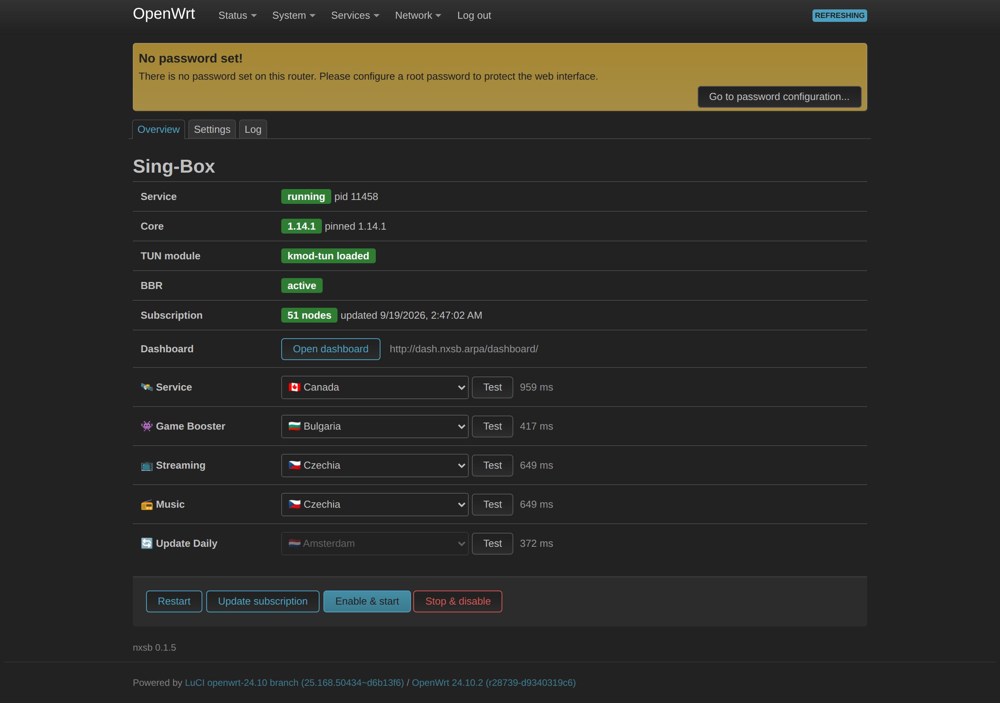
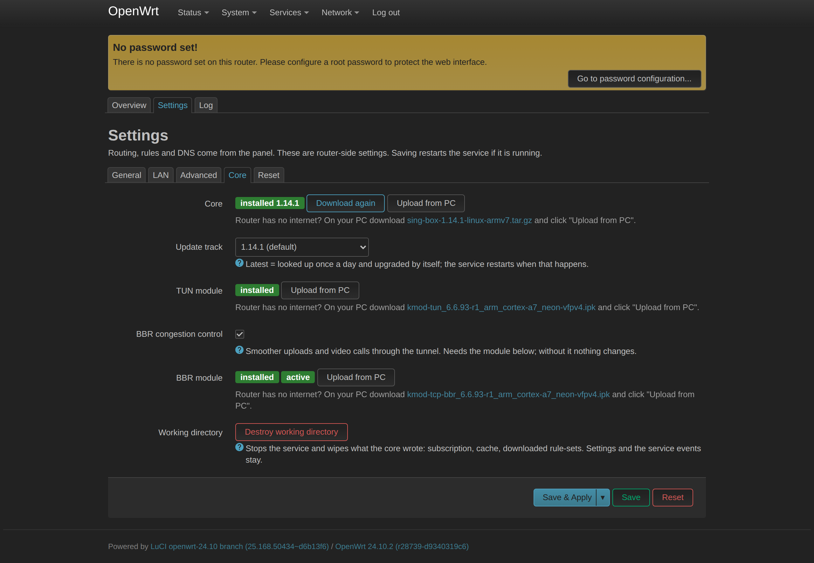
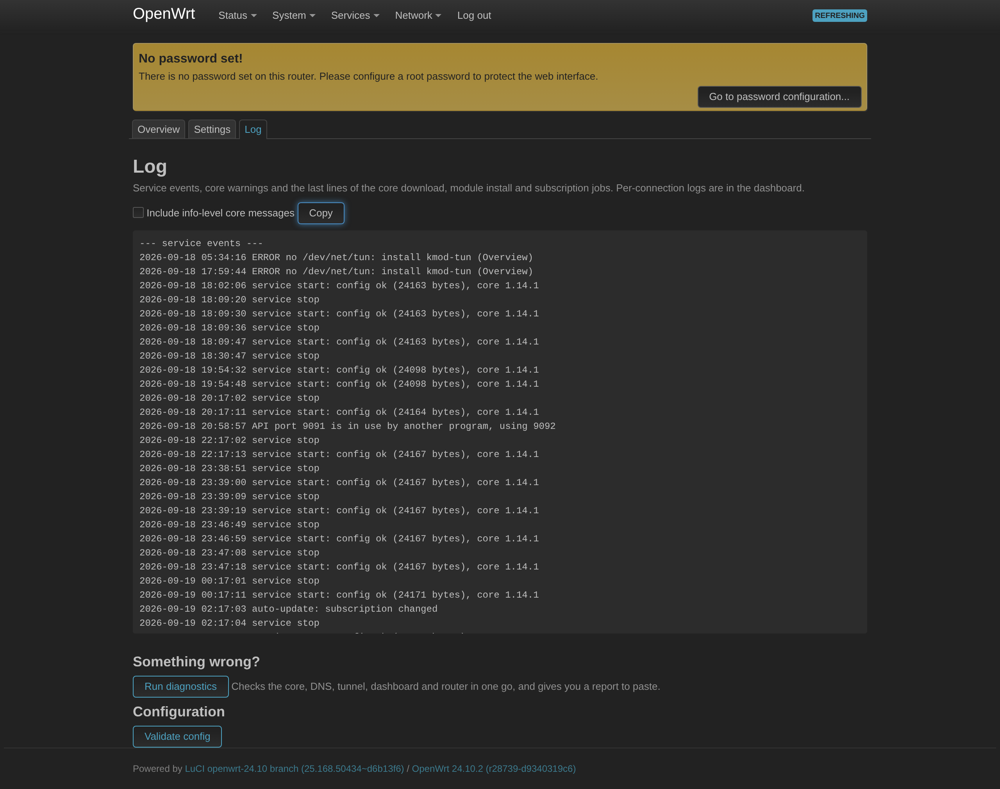
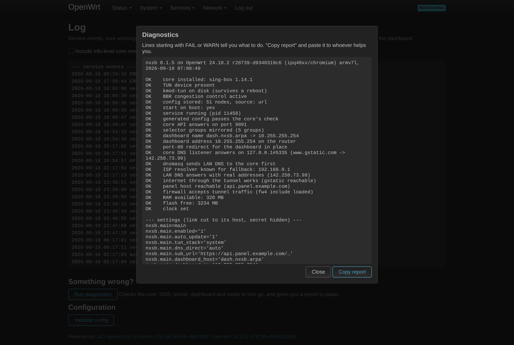
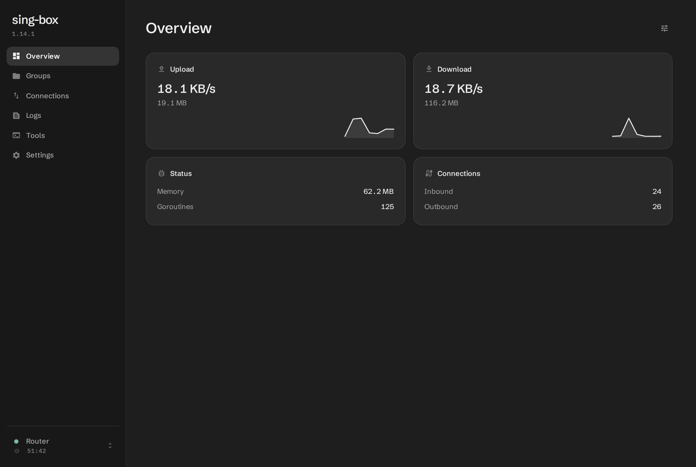
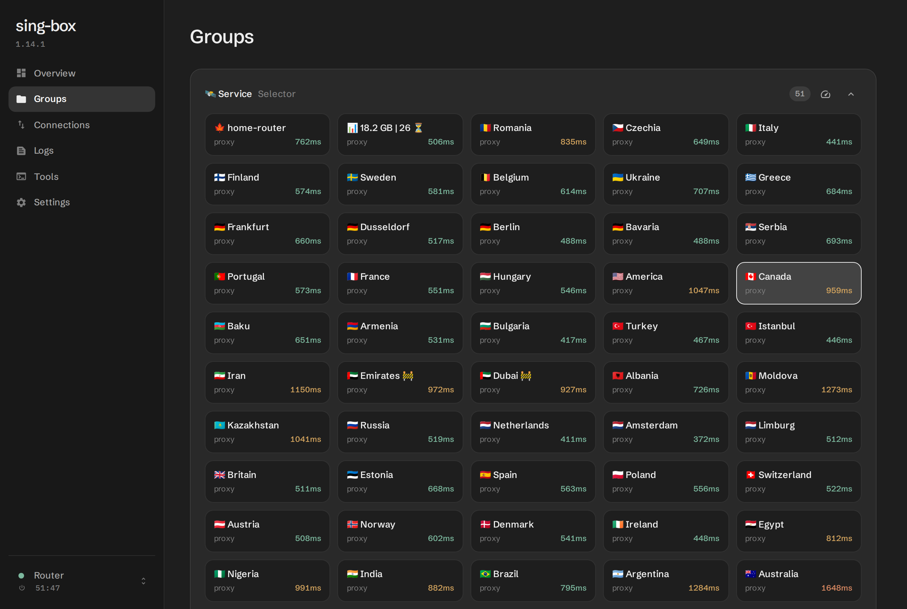
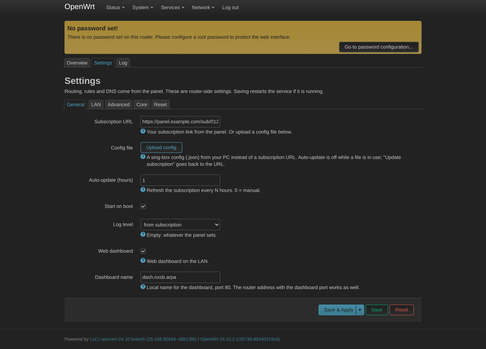
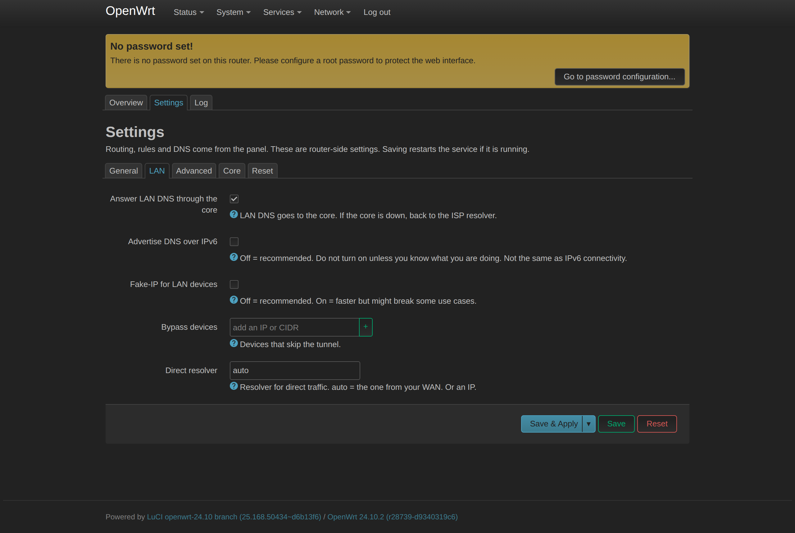
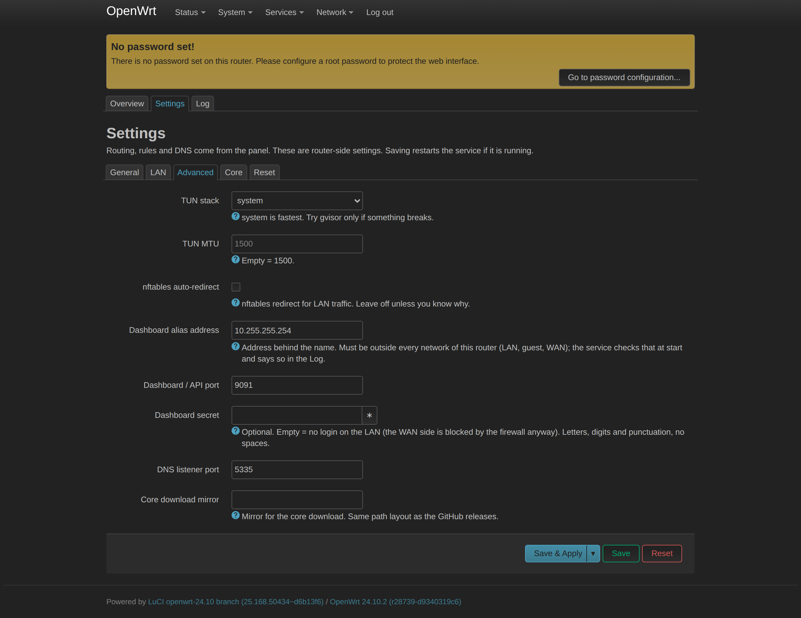
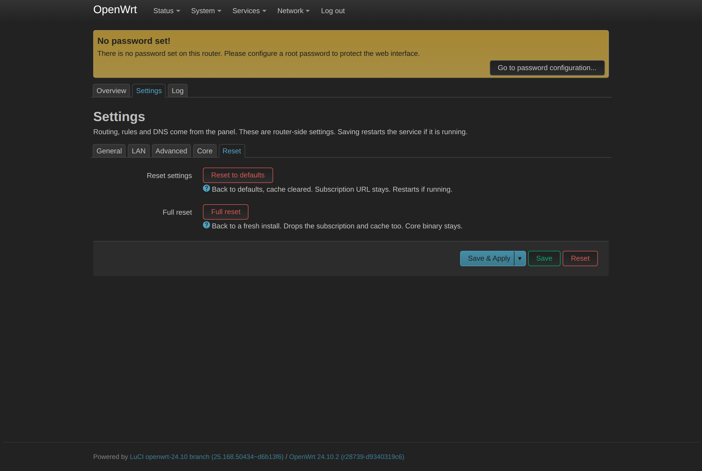

[فارسی](README.md)

# Sing-box OpenWrt

Run and manage the Sing-box core on an OpenWrt router, from LuCI.

Tested on a Google Router running OpenWrt 24.10.

## Screenshots

| Overview | Settings » Core |
|---|---|
| [](docs/screenshots/01-overview.png) | [](docs/screenshots/05-settings-core.png) |

| Log | Diagnostics |
|---|---|
| [](docs/screenshots/07-log.png) | [](docs/screenshots/08-diagnostics.png) |

| Dashboard | Groups and locations |
|---|---|
| [](docs/screenshots/09-dashboard-overview.png) | [](docs/screenshots/10-dashboard-groups.png) |

<details><summary>Other tabs</summary>

[](docs/screenshots/02-settings-general.png)

[](docs/screenshots/03-settings-lan.png)

[](docs/screenshots/04-settings-advanced.png)

[](docs/screenshots/06-settings-reset.png)

</details>

## Install

1. Grab the latest `.ipk` from [releases](https://github.com/nxdomainx/sing-box-luci-app/releases/latest). One file, every build.
2. In LuCI: `System » Software » Upload Package`. Or from a terminal:

```bash
opkg install /tmp/nxdomainx-luci-app-sing-box_0.1.0_all.ipk
```

> **Note:** during install the router downloads the Sing-box core and the kernel modules from the internet, so it can take a while.

3. Put your subscription link in `Services » Sing-Box » Settings` and save.
4. On the Overview page: **Update subscription**, then **Enable & start**.

Dashboard: `http://dash.nxsb.arpa/dashboard/`

## Offline install

No internet on the router? Upload the core and the kernel modules in the Core tab; the exact file for that router is named there.

## Troubleshooting

Log page » **Run diagnostics**, then **Copy report**. From a terminal:

```bash
/etc/init.d/nxsb diag
```

## Remove

```bash
opkg remove nxdomainx-luci-app-sing-box
```

## For developers

```
files/etc/init.d/nxsb                  procd service, dnsmasq drop-in, check/generate/diag
files/usr/lib/nxsb/                    core.sh, deps.sh, dns6.sh, diag.sh, generate.uc, subscribe.uc, groups-watch.uc
files/usr/share/ucode/nxsb/grpc.uc     gRPC-Web client for the core's api service
files/usr/share/rpcd/ucode/luci.nxsb   ubus object luci.nxsb
files/www/luci-static/resources/       the three pages and their shared code
control/                               ipk control, postinst, prerm, postrm
```

The panel subscription owns routing, rules and DNS; the app stores it as-is and only adds what a router needs
(TUN, a DNS listener for dnsmasq, the api service, cache on flash). Every start validates the generated config
with the core, so a bad config never replaces a running one.
